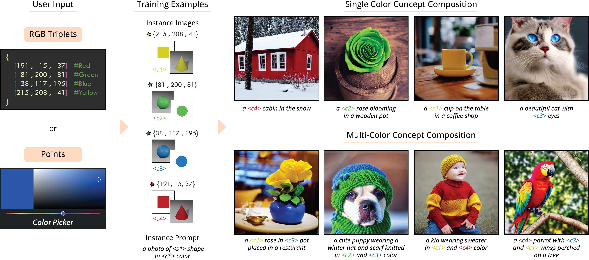

# ColorPeel: Color Prompt Learning with Diffusion Models via  Color and Shape Disentanglement [ECCV 2024]


Given the RGB triplets or color coordinates, ColorPeel generates basic 2D or 3D geometries with target colors for color learning. This facilitates the disentanglement of color and shape concepts, allowing for personalized color usage in image generation.

### ColorPeel: Color Prompt Learning with Diffusion Models via  Color and Shape Disentanglement
[Muhammad Atif Butt](https://scholar.google.com/citations?user=vf7PeaoAAAAJ&hl=en), [Kai Wang](https://scholar.google.com/citations?user=j14vd0wAAAAJ&hl=en), [Javier Vazquez-Corral](https://scholar.google.com/citations?user=gjnuPMoAAAAJ&hl=en), and [Joost van de Weijer](https://scholar.google.com/citations?user=Gsw2iUEAAAAJ&hl=en)

<hr>

## Installations (for local execution with PyTorch)
Before running the scripts, make sure to install diffusers from source. Note that ColorPeel is developed on **Diffusers 0.17.0**.
To install diffusers from source, do the following steps:

```sh
git clone https://github.com/huggingface/diffusers
cd diffusers
pip install -e .
```

After successful installation, download/clone the **ColorPeel** repoistory.

```sh
https://github.com/moatifbutt/color-peel.git
cd color-peel
pip install -r requirements.txt
```

And initialize an 🤗Accelerate environment with:

```sh
accelerate config
```

Or for a default accelerate configuration without answering questions about your environment.

```sh
accelerate config default
```

## Dataset
We provide two sample datasets for learning colors from 2D and 3D shapes. These datasets are available in data repository along with the `concepts.json` which contain information regarding the class images and their corresponding conditioning prompts.

**Custom Dataset (2D)**: Users can also create their own dataset using the following script.

```sh
python src/draw_shapes.py 512 --shapes circle rectangle --rgb_values "235,33,33" "33,235,33" "33,33,235" "235,235,33" --out data/dataset
```
